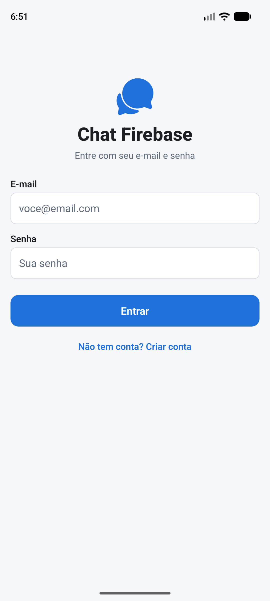
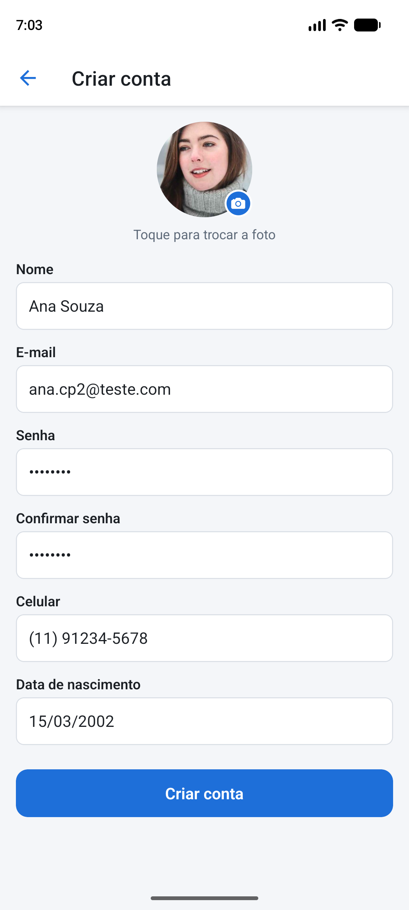
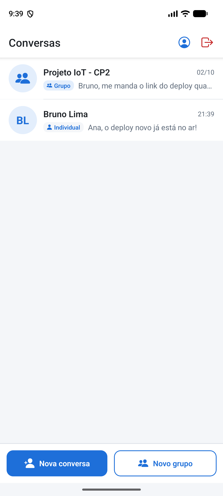
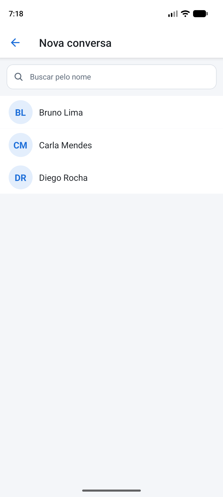
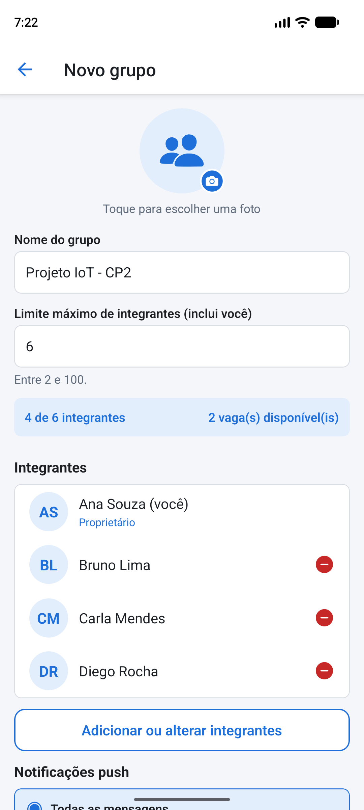
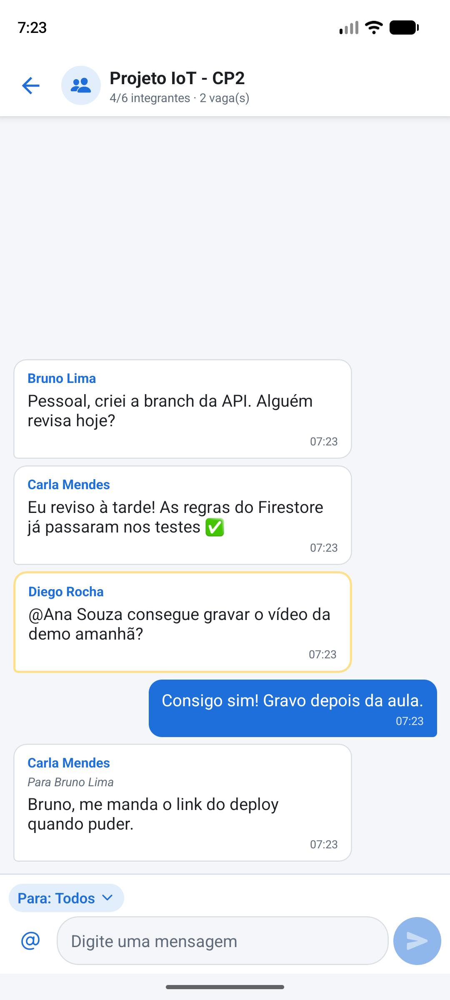
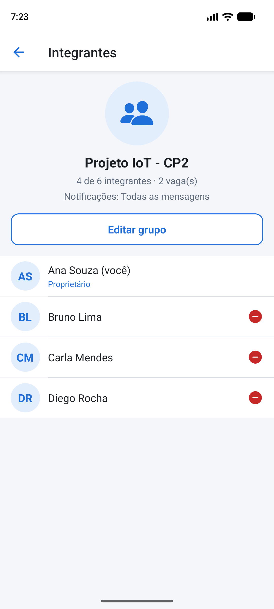
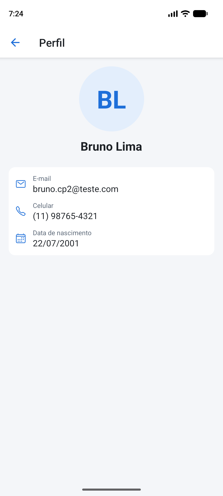
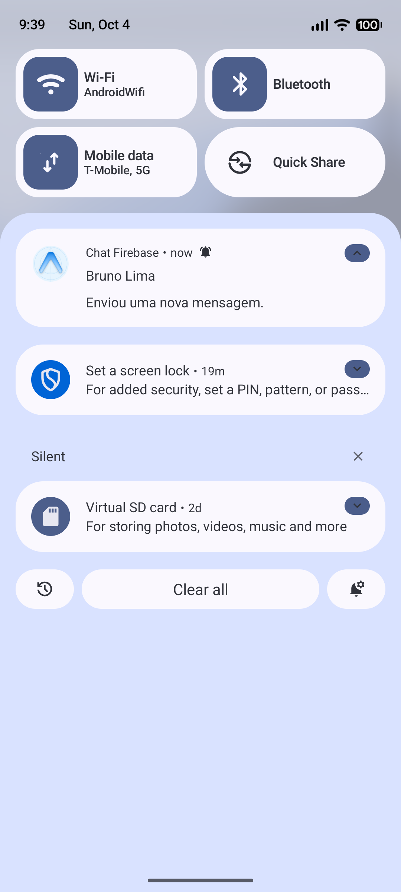

# 💬 Chat Firebase — React Native

Aplicativo de chat em **React Native + Expo + TypeScript** com conversas individuais e em grupo, mensagens em tempo real no **Firebase Realtime Database**, perfis e grupos no **Cloud Firestore**, autenticação por **e-mail e senha** e **notificações push** enviadas por uma **API própria** publicada na Vercel.

## Integrantes

- RM555780 — Arnaldo
- RM99849 — Carlos Eduardo
- RM556013 — Vinicius Gardim
- RM550413 — Leonardo Correia
- RM555017 — Fabricio Carlos

## Links da entrega

| Item | URL |
|---|---|
| Repositório | https://github.com/leleostonks/CheckPoint-2---Mobile-Development-IoT |
| API online | https://check-point-2-mobile-development-io.vercel.app |
| Health check | https://check-point-2-mobile-development-io.vercel.app/health |
| APK Android (instalação direta) | https://expo.dev/artifacts/eas/-EvQpcg8Fc2UnGFZnmePn1-1WFHrMy4vDLj2upIn9DU.apk |

---

## 🧰 Tecnologias

| Camada | Tecnologia |
|---|---|
| App | React Native 0.86, **Expo SDK 57**, TypeScript (strict, sem `any`), Expo Router |
| Autenticação | Firebase Authentication (somente e-mail/senha) |
| Mensagens | Firebase Realtime Database |
| Perfis, grupos, tokens | Cloud Firestore |
| Push | Firebase Cloud Messaging (Android) + Expo Push Service (iOS), via `expo-notifications` |
| Fotos | Cloudinary (upload assinado pela API) |
| API | Node.js 20+, Express 5, Firebase Admin SDK, Zod, hospedada na **Vercel** |

## 🔥 Responsabilidade de cada serviço

| Serviço | O que guarda / faz |
|---|---|
| **Authentication** | Criação de conta, login, sessão persistida (AsyncStorage), `uid`, logout. |
| **Realtime Database** | `messages/{conversationId}/{messageId}` (todas as mensagens, individuais e de grupo) e listeners em tempo real. `conversationMembers/{groupId}`: espelho dos integrantes, gravado **somente pela API**, usado pelas regras. |
| **Cloud Firestore** | `users/{uid}` (perfil completo, privado), `publicProfiles/{uid}` (nome e foto para busca), `users/{uid}/devices/{id}` (tokens de push), `groups/{groupId}` (metadados, integrantes, `memberLimit`, `notificationPolicy`), `directConversations/{id}`, `notificationDeliveries/{id}` (idempotência, só API). |
| **Cloud Messaging** | Entrega do push em segundo plano/app fechado, com `conversationId` e `conversationType` no payload. |
| **API (Vercel)** | Valida o ID token, confirma a mensagem, calcula destinatários pela política, envia o push, sincroniza o espelho de integrantes, entrega perfis de terceiros e assina uploads. |

### Estrutura dos dados

```text
Firestore
  users/{uid}                 name, email, phoneNumber, birthDate, photoUrl, createdAt
  users/{uid}/devices/{id}    token, tokenType (fcm|expo), platform, enabled, updatedAt
  publicProfiles/{uid}        name, nameLower, photoUrl
  groups/{groupId}            name, photoUrl, ownerId, memberIds, memberLimit,
                              notificationPolicy, updatedBy, createdAt, updatedAt
  directConversations/{id}    participantIds, createdAt        (id = direct_<uidA>_<uidB>, uids ordenados)
  notificationDeliveries/{id} controle de duplicidade (somente API)

Realtime Database
  messages/{conversationId}/{messageId}
      conversationId, conversationType, senderId, text,
      target {type: conversation | member, memberId?}, mentionedUserIds[], createdAt
  conversationMembers/{groupId}/{uid}: true               (somente API)
```

---

## 📁 Estrutura do projeto

```text
src/
  app/                  rotas (Expo Router): login, register, index (conversas), users,
                        group-form, chat/[conversationId], profile/[uid], group-members/[groupId]
  screens/              LoginScreen, RegisterScreen, ConversationsScreen, UsersScreen,
                        GroupFormScreen, ChatScreen, ProfileScreen, GroupMembersScreen
  components/           ChatMessage, ChatInput, ConversationItem, GroupMemberItem, Avatar,
                        Loading, ErrorMessage, EmptyState, MemberPickerModal, PolicySelector...
  services/             firebase, authService, userService, groupService, chatService,
                        notificationService, imageService, apiClient
  hooks/                useAuth, useChat, useGroups, useConversations, useNotifications,
                        usePublicProfiles, useConnection
  contexts/             AuthContext, NotificationContext
  types/                user, chat, group, notification
  utils/                conversationId, groupValidation, errorMessages, formatters, parse...
server/                 API (Express + Firebase Admin) publicada na Vercel
  src/app.ts            app Express (entrada detectada pela Vercel)
  src/middleware/       authenticate.ts (Firebase ID Token)
  src/routes/           notifications, groups, profiles, uploads, health
  src/services/         firebaseAdmin, recipientResolver, notificationSender, deliveryGuard, cloudinary
firebase/
  firestore.rules       regras do Firestore
  database.rules.json   regras do Realtime Database
  tests/                testes automatizados das regras (emuladores)
firebaseConfig.json     configuração do SDK cliente (sem credenciais administrativas)
```

---

## ⚙️ Configuração do Firebase

1. Crie um projeto no [Firebase Console](https://console.firebase.google.com/).
2. **Authentication** → Método de login → ative **E-mail/senha** (somente ele).
3. **Firestore Database** → criar banco (modo produção).
4. **Realtime Database** → criar banco (modo bloqueado).
5. **Configurações do projeto → Seus apps**:
   - Adicione um app **Web** e copie o objeto `firebaseConfig` para o arquivo [`firebaseConfig.json`](firebaseConfig.json) (inclua `databaseURL`).
   - Adicione um app **Android** com o pacote `br.com.fiap.chatfirebase` e baixe o `google-services.json` para a raiz do projeto (necessário para o FCM).
6. Publique as regras versionadas:

   ```bash
   npm install -g firebase-tools
   firebase login
   firebase deploy --only firestore:rules,database --project SEU_PROJECT_ID
   ```

### Conta de serviço com permissões mínimas (API)

Em vez de usar a conta `firebase-adminsdk` padrão (com permissões amplas), crie no **Google Cloud Console → IAM → Contas de serviço** uma conta dedicada com apenas:

| Papel | Por quê |
|---|---|
| `Cloud Datastore User` | ler/gravar Firestore (grupos, tokens, idempotência) |
| `Firebase Realtime Database Admin` | ler mensagens e gravar o espelho `conversationMembers` |
| `Firebase Cloud Messaging API Admin` | enviar push |

Gere uma chave JSON dessa conta e copie `project_id`, `client_email` e `private_key` **somente para as variáveis da Vercel**. Depois apague o arquivo baixado. A validação do ID token não exige papel extra.

---

## 🖼️ Armazenamento das fotos — Cloudinary

O Firebase Storage exige o plano Blaze (cartão de crédito) em projetos novos, então as fotos ficam no **Cloudinary** (plano gratuito).

- O app pede à API uma **assinatura temporária** (`POST /uploads/signature`); o `API secret` nunca sai da Vercel.
- O app envia a imagem direto ao Cloudinary e grava **apenas a URL** (`photoUrl`) no Firestore. Nada de Base64 nos bancos: as regras exigem uma URL `https://`.
- Permissão da galeria é solicitada e tratada; sem foto (ou se falhar ao carregar) é exibida uma imagem padrão.

**Configuração:** crie uma conta em [cloudinary.com](https://cloudinary.com/), copie *Cloud name*, *API Key* e *API Secret* (Dashboard → API Keys) para as variáveis da API.

---

## 🌐 API online (Vercel)

**Tecnologia:** Node.js + Express 5 + Firebase Admin SDK + Zod, em TypeScript. Não usa Cloud Functions.

### Endpoints

| Método | Rota | Auth | Descrição |
|---|---|---|---|
| GET | `/health` | — | Health check: `status`, horário e se Firebase/Cloudinary estão configurados (sem expor valores). |
| POST | `/notifications/messages` | Bearer ID token | Body `{ conversationId, messageId }`. Valida, calcula destinatários e envia o push. Idempotente. |
| POST | `/groups/:groupId/sync-members` | Bearer ID token | Espelha os integrantes do Firestore em `conversationMembers/{groupId}` (RTDB). |
| GET | `/profiles/:uid` | Bearer ID token | Dados cadastrais, somente se houver conversa individual ou grupo em comum. |
| POST | `/uploads/signature` | Bearer ID token | Assinatura de upload do Cloudinary (`{ folder: "profiles" \| "groups" }`). |

Fluxo do push (`POST /notifications/messages`):

1. O app grava a mensagem no Realtime Database e envia `conversationId` + `messageId` com o ID token.
2. A API valida o token com o Admin SDK.
3. Lê a mensagem no RTDB e confirma que `senderId` é o usuário autenticado.
4. Lê no Firestore os participantes/integrantes, a política e os tokens ativos.
5. Calcula os destinatários **no servidor** (nunca aceita lista do app) e remove o remetente.
6. Registra `notificationDeliveries/{conversationId}__{messageId}` com `create()` atômico: reenvios retornam `duplicate` e não geram push repetido.
7. Envia pelo FCM (tokens Android) e pelo Expo Push Service (tokens iOS); tokens inválidos são desativados.

O texto do push não inclui o conteúdo da mensagem (ex.: “Ana enviou uma mensagem.”), só remetente e conversa.

### Variáveis de ambiente (nomes)

Veja [`server/.env.example`](server/.env.example): `FIREBASE_PROJECT_ID`, `FIREBASE_CLIENT_EMAIL`, `FIREBASE_PRIVATE_KEY`, `FIREBASE_DATABASE_URL`, `CLOUDINARY_CLOUD_NAME`, `CLOUDINARY_API_KEY`, `CLOUDINARY_API_SECRET`.

### Publicar na Vercel

1. Importe o repositório em [vercel.com/new](https://vercel.com/new).
2. Em **Root Directory**, selecione `server` (a Vercel detecta o Express em `src/app.ts`).
3. Em **Settings → Environment Variables**, cadastre as variáveis acima (em `FIREBASE_PRIVATE_KEY`, cole a chave inteira; `\n` literais são convertidos).
4. Deploy. Verifique: `curl https://SEU-PROJETO.vercel.app/health` → `{"status":"ok", ...}`.
5. Coloque a URL em `DEFAULT_API_URL` no arquivo [`src/config.ts`](src/config.ts), para o app funcionar sem configuração extra.

A Vercel mantém a API sempre disponível (sem servidor local e sem “hibernar”).

### Executar a API localmente (opcional)

```bash
cd server
npm install
cp .env.example .env   # preencha com valores reais (arquivo ignorado pelo git)
npm run dev            # http://localhost:3000
npm test               # testes das políticas de destinatários
```

---

## 📱 Executar o aplicativo

Push remoto **não funciona no Expo Go** (SDK 53+), então é necessário um *development build*.

```bash
npm install
npx eas-cli@latest login
npx eas-cli@latest init                       # vincula o projeto EAS (gera o projectId)
npx eas-cli@latest build --profile development --platform android
# instale o APK gerado no celular e então:
npx expo start
```

Alternativa com Android Studio instalado: `npx expo run:android`.

Variáveis opcionais do app: [`.env.example`](.env.example) (`EXPO_PUBLIC_API_URL`, `EAS_PROJECT_ID`, `ANDROID_PACKAGE`, `IOS_BUNDLE_ID`). Nenhuma é secreta.

### Notificações no Android

- `google-services.json` na raiz (ou variável de arquivo `GOOGLE_SERVICES_JSON` no EAS).
- O app cria o canal `messages` (importância alta) e pede a permissão (Android 13+).
- O token nativo do FCM (`getDevicePushTokenAsync`) é salvo em `users/{uid}/devices`.
- Teste em **dispositivo físico** ou em um **emulador Android com Google Play** (imagem "Google Play").

### Notificações no iOS

- Exige conta Apple Developer (paga) e build pelo EAS (`--platform ios`), que configura a chave APNs.
- O app registra um token do Expo Push Service (`getExpoPushTokenAsync` com o `projectId` do EAS), e a API entrega por ele.

### Ao tocar na notificação

O payload traz `conversationId` e `conversationType`; `useLastNotificationResponse` trata app aberto, em segundo plano e fechado, e o app navega para a conversa correta depois do login. Com a conversa aberta na tela, o banner daquela conversa é suprimido.

---

## 🔔 Política de notificações (por grupo)

Configurada pelo proprietário na tela de criação/edição do grupo.

| Política | Quem recebe push |
|---|---|
| `all_group_messages` | Todos os integrantes, exceto o remetente. |
| `mentioned_members` | Apenas integrantes mencionados (`@`) ou selecionados como destinatário (“Para: Fulano”). |
| `direct_messages_only` | Ninguém: mensagens do grupo não geram push (só conversas individuais geram). |
| `disabled` | Ninguém. |

Regras gerais, aplicadas na API ([`recipientResolver.ts`](server/src/services/recipientResolver.ts)): o remetente nunca recebe; só integrantes atuais recebem; conversas individuais sempre notificam o outro participante. A lógica é coberta por testes em [`recipientResolver.test.ts`](server/src/services/recipientResolver.test.ts).

---

## 👥 Limite de integrantes e concorrência

- `memberLimit` é definido na criação (inteiro de 2 a 100, **incluindo o proprietário**) e pode ser alterado pelo proprietário.
- A interface mostra a quantidade atual e as **vagas disponíveis**, e impede selecionar além do limite.
- O `groupService` altera integrantes dentro de uma **transação do Firestore**: lê a versão mais recente, aplica as mudanças (sem sobrescrever alterações de outros) e valida o limite.
- **As regras do Firestore repetem a validação no servidor:** `memberIds.size() <= memberLimit`, `memberLimit >= memberIds.size()`, sem duplicados, somente o proprietário altera. As regras avaliam o documento **resultante** de cada escrita, e o Firestore serializa escritas concorrentes no mesmo documento. Por isso duas entradas simultâneas nunca ultrapassam o limite, mesmo vindas de um cliente modificado.

Isso é comprovado por um teste automatizado nos emuladores. Com 1 vaga e 2 entradas simultâneas (`arrayUnion`), exatamente uma é aceita:

```bash
cd firebase/tests
npm install
npm test        # requer Java 21+ (emuladores do Firebase) — 18 testes das regras
```

---

## 🔒 Segurança

Regras versionadas: [`firebase/firestore.rules`](firebase/firestore.rules) e [`firebase/database.rules.json`](firebase/database.rules.json).

- Somente usuários autenticados acessam dados; nada é público.
- **Mensagens:** só participantes leem/enviam; `senderId` deve ser o `auth.uid`; mensagens não podem ser editadas/sobrescritas; `createdAt` = horário do servidor; destinatário e menções precisam ser integrantes.
- **Conversas individuais:** id `direct_<uidA>_<uidB>` com uids ordenados, o que garante exatamente 2 participantes, nenhuma conversa consigo mesmo e nenhuma duplicata.
- **Grupos:** só integrantes leem; só o proprietário gerencia; limite validado nas regras.
- **Tokens de dispositivos:** legíveis apenas pelo dono; removidos no logout.
- **Dados cadastrais:** `users/{uid}` só é lido pelo próprio dono. Perfis de terceiros passam pela API, que confere se existe conversa/grupo em comum. A lista de usuários usa `publicProfiles` (só nome e foto).
- **Usuário removido de grupo:** perde a leitura do grupo no Firestore e, após a sincronização, do espelho no RTDB, deixando de ler e enviar mensagens novas.

**Decisão documentada:** as regras do Realtime Database não conseguem consultar o Firestore. Por isso a API (Admin SDK) espelha os integrantes do grupo em `conversationMembers/{groupId}`, que o app não pode gravar, e faz as validações que cruzam os dois bancos (push, perfis).

Credenciais administrativas existem **somente** nas variáveis da Vercel. `firebaseConfig.json` contém apenas a configuração do SDK cliente, e o `.gitignore` bloqueia `.env`, `serviceAccountKey*.json` e chaves `*-firebase-adminsdk-*.json`.

---

## 🖥️ Telas

| Login | Cadastro | Conversas | Usuários |
|---|---|---|---|
|  |  |  |  |

| Criar/editar grupo | Chat em grupo | Integrantes | Perfil |
|---|---|---|---|
|  |  |  |  |

### Evidência de notificação recebida



Push real entregue pela API (FCM) com o app em segundo plano; ao tocar na notificação, o app abre a conversa correspondente.

---

## ✅ Qualidade

```bash
npm run typecheck      # tsc --noEmit (app)
npm run lint           # expo lint (inclui regra no-explicit-any)
cd server && npm run typecheck && npm test
```
